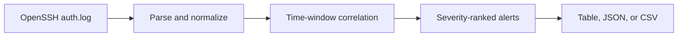

# SIEM Log Detector

[](https://github.com/ngobenitech/SIEM-LOG-DETECTOR/actions/workflows/ci.yml)
[](https://www.python.org/downloads/)
[](LICENSE)

A Python detection-engineering project that parses OpenSSH authentication logs,
normalizes login activity, correlates events inside defined time windows, and
produces investigation-ready alerts.

This project demonstrates the core logic behind a small SIEM detection pipeline.
It is not presented as a replacement for a production SIEM.

## Demonstrated result

Running the detector against the included synthetic log produces three distinct
signals:

```text
Input: sample_logs/auth.log
Parsed: 15 events from 17 lines (2 skipped)
Alerts: 3

RULE         SEVERITY  HOST        SOURCE IP      USER     EVENTS  TITLE
-----------  --------  ----------  -------------  -------  ------  --------------------------------------------
SSH-SAF-003  CRITICAL  app-01      192.0.2.44     analyst  4       Successful SSH login after repeated failures
SSH-BF-001   HIGH      web-01      203.0.113.10   root     5       Repeated SSH authentication failures
SSH-PS-002   HIGH      bastion-01  198.51.100.25  -        4       Possible SSH password spraying
```

The exact command output and machine-readable reports are committed under
[`evidence/`](evidence/) and [`reports/`](reports/).

## Detection coverage

| Rule | Detection | Default logic | Severity | MITRE ATT&CK |
|---|---|---|---|---|
| `SSH-BF-001` | Repeated SSH failures | 5 failures from one source in 5 minutes | High | [T1110](https://attack.mitre.org/techniques/T1110/), [T1110.001](https://attack.mitre.org/techniques/T1110/001/) |
| `SSH-PS-002` | Possible password spraying | 4 distinct accounts from one source in 10 minutes | High | [T1110.003](https://attack.mitre.org/techniques/T1110/003/) |
| `SSH-SAF-003` | Success after repeated failures | 3 failures followed by success for the same host, source, and user in 10 minutes | Critical | [T1110](https://attack.mitre.org/techniques/T1110/), [T1078](https://attack.mitre.org/techniques/T1078/) |

`SSH-SAF-003` is a correlation signal requiring investigation. The detector does
not claim that a successful login proves account compromise.

## Processing flow



## Quick start

Requirements:

- Python 3.10 or newer
- No runtime dependencies outside the Python standard library

Clone and install:

```bash
git clone https://github.com/ngobenitech/SIEM-LOG-DETECTOR.git
cd SIEM-LOG-DETECTOR
python -m venv .venv
source .venv/bin/activate
python -m pip install --upgrade pip
python -m pip install -e .
```

On Windows PowerShell, activate the environment with:

```powershell
.\.venv\Scripts\Activate.ps1
```

Run the included scenario:

```bash
siem-detect sample_logs/auth.log
```

The package can also run without installing the console command:

```bash
python -m siem_log_detector sample_logs/auth.log
```

## Reports and tuning

Write JSON or CSV output:

```bash
siem-detect sample_logs/auth.log --format json --output reports/alerts.json
siem-detect sample_logs/auth.log --format csv --output reports/alerts.csv
```

Tune correlation thresholds:

```bash
siem-detect sample_logs/auth.log \
  --brute-force-threshold 8 \
  --brute-force-window 5 \
  --spray-user-threshold 6 \
  --spray-window 15
```

Return exit code `1` when an alert is detected, which is useful for scripted
validation:

```bash
siem-detect sample_logs/auth.log --fail-on-alert
```

View every option:

```bash
siem-detect --help
```

## Supported input

The parser currently handles OpenSSH records for:

- failed password authentication;
- accepted password authentication;
- accepted public-key authentication;
- IPv4 and IPv6 source addresses;
- traditional `auth.log` timestamps such as `May  4 01:14:35`;
- ISO 8601 timestamps such as `2026-07-29T09:00:00Z`.

Traditional syslog timestamps do not contain a year. Use `--year 2026` when the
current year is not correct for the log being analyzed.

Unsupported and unrelated records are counted as skipped. Invalid IP addresses
are rejected rather than added to the detection pipeline.

## Validation

Run the complete test suite:

```bash
python -m unittest discover -s tests -v
```

Run the linter after installing the development tools:

```bash
python -m pip install -e ".[dev]"
python -m ruff check src tests
```

The tests cover:

- parsing successes, failures, IPv4, IPv6, and both timestamp formats;
- invalid and unrelated log records;
- threshold and time-window boundaries;
- brute-force and password-spray detections;
- success-after-failure correlation;
- negative cases that must not alert;
- table, CSV, JSON, CLI, and exit-code behavior.

GitHub Actions runs compilation, linting, tests, and the sample scenario on
Python 3.10, 3.11, and 3.12.
See [`docs/VALIDATION.md`](docs/VALIDATION.md) for the test matrix.

## Repository layout

```text
.
├── .github/workflows/ci.yml
├── docs/
│   ├── DETECTION_ENGINEERING.md
│   ├── INVESTIGATION_RUNBOOK.md
│   └── VALIDATION.md
├── evidence/sample-run.txt
├── reports/
├── sample_logs/
├── src/siem_log_detector/
├── tests/
├── LICENSE
└── pyproject.toml
```

## Engineering decisions

- Time-window correlation prevents a few failures spread across many hours from
  being treated as one attack.
- Alerts preserve the matching raw log lines so an analyst can validate the
  detection.
- Thresholds are configurable because authentication baselines differ between
  environments.
- JSON output includes a schema version, ingestion statistics, active
  configuration, and analyst actions.
- The tool has no runtime dependencies, keeping setup and review straightforward.

## Known limitations

- Only OpenSSH authentication records are supported.
- Traditional syslog year rollover is not inferred automatically.
- The detector processes a file as a batch; it does not provide live ingestion.
- No reputation, asset criticality, allow-list, or identity-provider enrichment
  is performed.
- Distributed brute-force activity from many low-volume source addresses is not
  currently detected.
- Threshold rules require environment-specific tuning before operational use.

These limits are deliberate and documented. Planned extensions should be driven
by additional telemetry and test cases rather than feature claims.

## Documentation

- [`DETECTION_ENGINEERING.md`](docs/DETECTION_ENGINEERING.md) explains data
  assumptions, rule logic, tuning, and false positives.
- [`INVESTIGATION_RUNBOOK.md`](docs/INVESTIGATION_RUNBOOK.md) provides a repeatable
  triage and escalation workflow.
- [`VALIDATION.md`](docs/VALIDATION.md) records expected test scenarios and
  reproducible commands.

## Author

Samongelo Elias Ngobeni<br>
Cybersecurity and IT support practitioner based in Pretoria, South Africa
